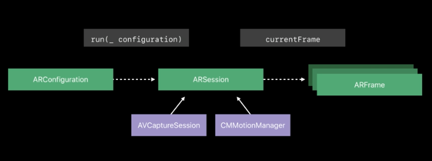
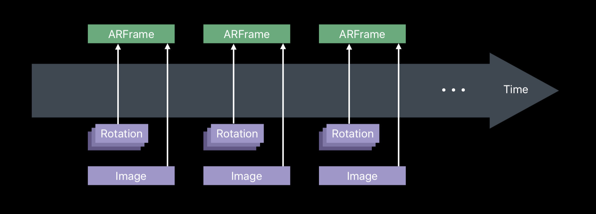
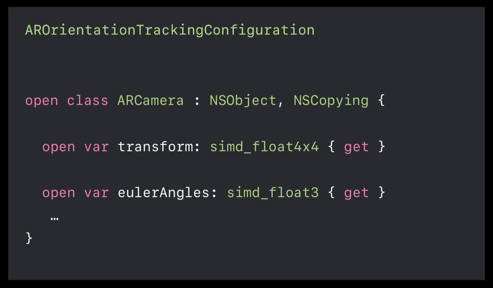
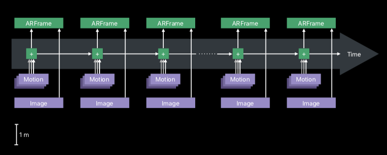
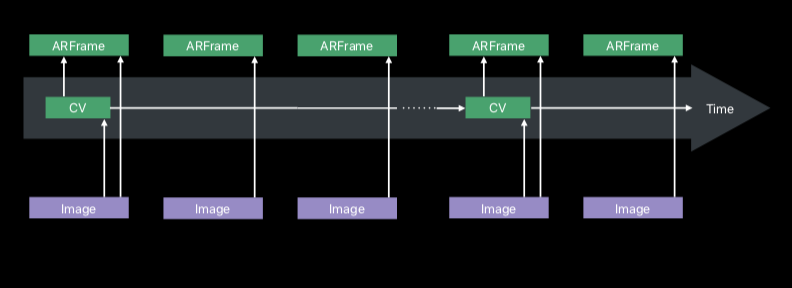
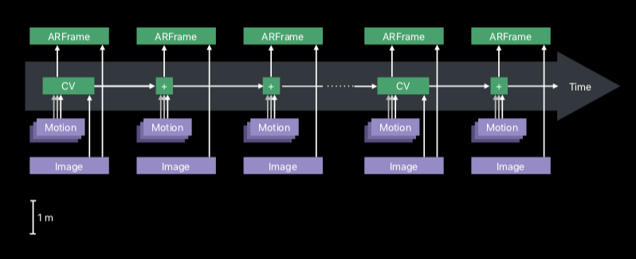
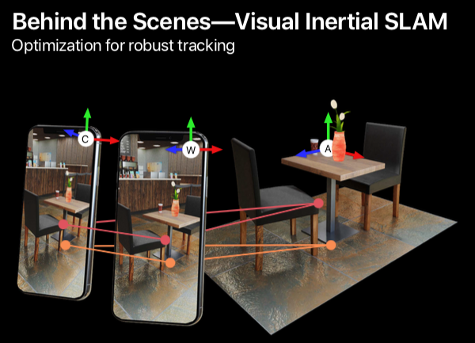
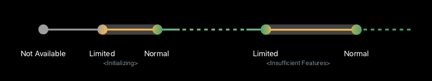

Tracking provides your camera viewing position and orientation into your physical environment, 
which will allow you to augment your virtual content into your camera's view.

Different tracking technologies are just providing a different reference system.

Orientation Tracking, World Tracking, and Plane Detection.
In ARKit 2, Saving and Loading Maps, Image Tracking, Object Detection.
ARFrame is a snapShot which gives you everything you need to render your augmented reality scene.

## Orientation Tracking
* Tracks orientation only (3 DoF)
* Spherical virtual environment
* Augmentation of far objects
* Not suited for physical world augmentation from different views.

camera feed is not processed in orientation tracking.

## World Tracking

tracks camera viewing orientation, and also, the change in position into your physical environment without any prior infomation about your environment.

World Tracking uses a motion sensor, the motion data of your mdevice's accelerometer and gyroscope to compute its change
 in orientation and translation on a high frequency. It also provides infomation in correct scale in Metal.
In literature, just this part of the tracking system is also called Inertial Odometry.
While this motion data provides good motion infomation for movement accross small time 
intervals and whenever there's like sudden movement, it does drift over large time intervals 
as the data is not ideally pprecise and subject to cumulative errors.

To compensate this drift, world tracking additional applies a computer version process in which it uses the camera frames. This technologe provides a high accuracy, but at the cost of computation time. This part of the tracking system is also called visual Odometry.

Combine technology is called Visual Intertial Odometry.

camera position and orientations of your sequences, denoted with a C. meaning the world tracking is initialed.
And it is set to the first camera's origin of the triangulated frames. And it is also set to be gravity alighted. It is denoted with a W.
to place virtual content correctly to an ARSession, you should use ARAnchors from ARKit, which are denoted with an A.

Visual Inertial SLAM System.

World tracking relies on a constant stream of camera images and sensor data. If this is interrupted for too long, tracking will become limited,
world tracking works best in textured and well-lit environments because world tracking uses those visually robust points to map and finally triangulate its location. It is important that there is enough visual complexity in the 
environment.

* Uninterrupted soensor data
* Textured environments
* Static scenes

## Plane Detection

Plane Detection uses the world map provided by the world,
it does this by accumulating infomation over multiple ARFrames. So as the user moves 
around the scene, more and more information about the real surface is acquired.
It also allows the plane detection to provide and like extent the surface, like a convex hull.
If multiple planes belonging to the same physical surface are detected. they will be merged once 
they start overlapping. If horizontal and vertical planes intersect they are clipped at the line intersection, which is actually a new feature in ARKit 2.

Plane Detection have very little overhead as it repurposes the mapped 3D points from the world tracking.
And then it fits planes into those point clouds and over time continuously aggregates more and more points and 
merge the planes that start to overlap. 

As the Plane Detection reuses the 3D map from the world tracking.

Saving and Loading World Maps

* Acquire a good World Map
* Share the World Map
* Relocalize to World Map

Step one, Acquire a good World Map
* Internal tracking data
  * Map of 3D feature Points
  * Local appearance
* List of named anchors
* Serializable

in acquisition device, when we are in the map state we can take a picture of the scene and then,  ship that together with the world map, and on the receiving end we can ask the user find this view to start your shared experience.

## Image Tracking

